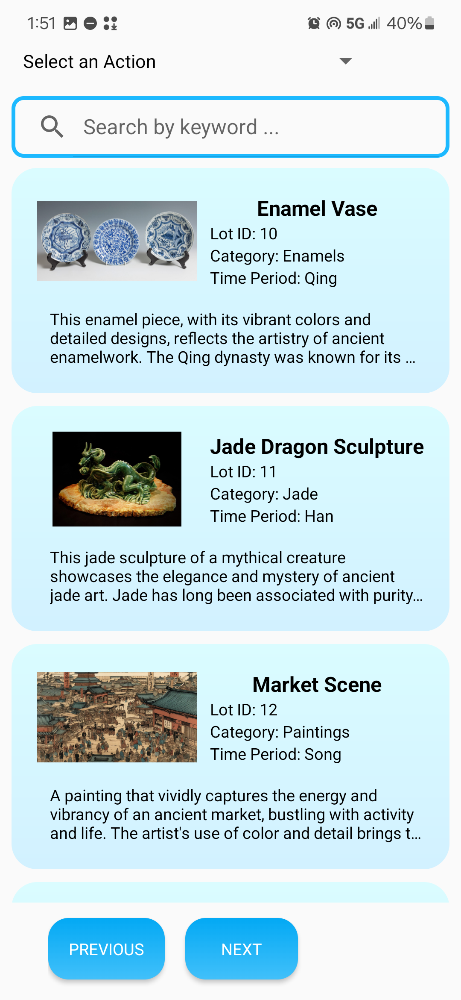
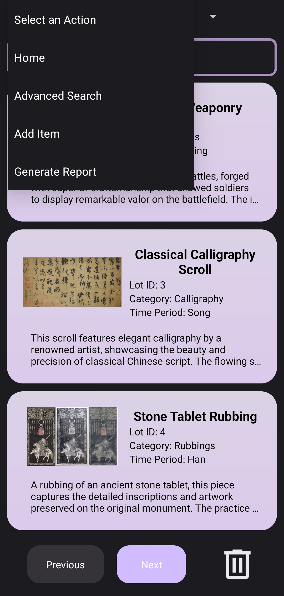
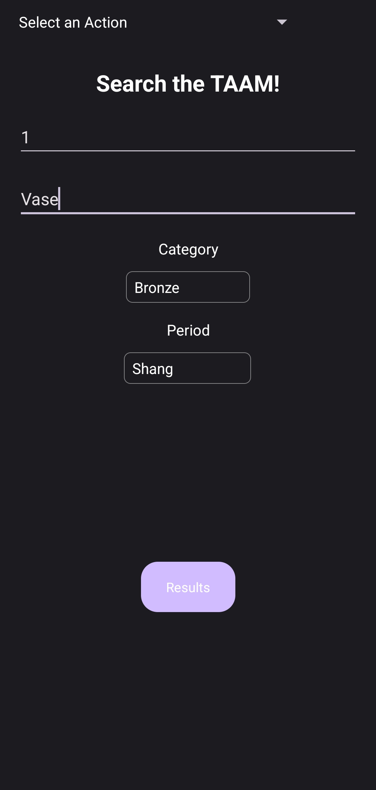
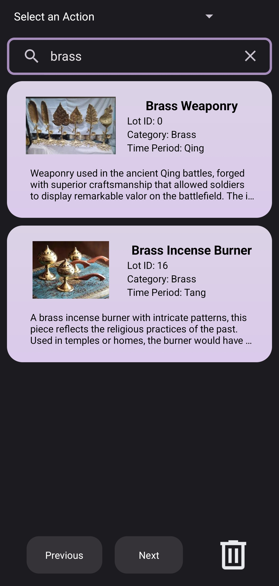
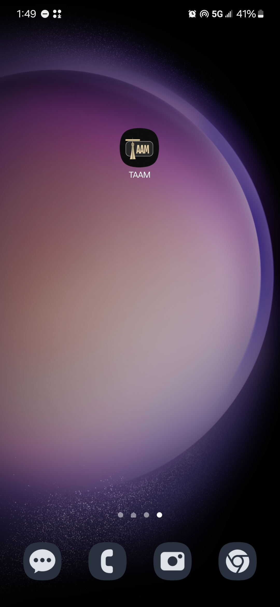

# The Toronto Asian Art Museum now has an Android App!

The Toronto Asian Art Museum, or TAAM, is a heritage art museum located in Scarborough, Ontario. This Android app was made in collaboration with the CSCB07 Software Design course at UTSC and in a group Agile/Scrum
framework. This Android app acts as a catalog manager for the museum and uses Firebase Realtime Database/Firebase storage to store museum artifacts and login/registration information.

This repo consists of a full-stack application where the backend consists of Java and uses various Android development practices such as an MVP architecture user authentication, fragment lifecycle management, XML 
modifications for enhanced UI/UX, and gradle scripts for configuration/build. The app also uses Mockito for testing purposes and Glide for media loading. This app is full of many, many features and can be 
modified/scaled to suit many purposes.


## Deployment

This repository is a fork of [Orion222's b07project](https://github.com/orion222/b07project) and contains only the master branch. The original project had over 200 commits, 40 merge pull requests, and over 10,000 code insertions.

### Option 1: Deployment through Git (for any device)

1. Clone the repository using Git:
    ```bash
    git clone https://github.com/zsspan/Toronto-Asian-Art-Museum-Android-App
    ```

2. Open the project in Android Studio:
    - Run the Gradle scripts in Android Studio. You should be automatically prompted to configure the build.
    - Open and run the `MainActivity.java` file on an emulator provided by Android Studio.

### Option 2: Direct APK Installation (specific to Android Device; simpler)

1. Download the APK file:
    - You can download the file [`TAAM.apk`](link-to-taam-apk) directly.

2. Install the APK:
    - Transfer the APK to your Android device and install it to run the application.

Feel free to choose the deployment method that best suits your needs.


## Usage

An in-depth demonstration video can be found on [https://www.youtube.com/watch?v=vxhOdGunL0w](https://www.youtube.com/watch?v=vxhOdGunL0w)

## Images

## Images

<p align="center">
  
  
  
</p>
<p align="center">
  
  
  
</p>
